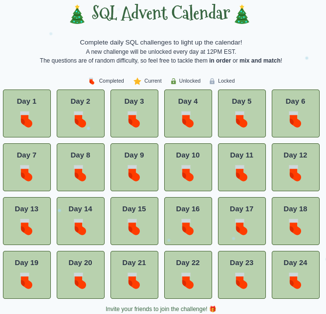

# 🌟 **SQL-Challenge-December-2024** 🌟  

Quer aprimorar suas habilidades em SQL? Explore minhas soluções para os desafios do SQL Advent Calendar.
Todos os dias, um novo desafio e uma nova oportunidade de aprender.
#SQLAdventCalendar #coding"

## 📋 **Sobre o Desafio**  
O **SQL Advent Calendar** é uma oportunidade incrível para aprimorar minhas habilidades em SQL.  
- 🔍 **Período:** 1º a 24 de dezembro.  
- 💡 **Desafio diário:** Uma nova questão SQL por dia.  
- 📈 **Níveis:** Questões variam de iniciante a avançado.  
- 🎁 **Objetivo:** Aprender, praticar e compartilhar conhecimento!  

Saiba mais e participe em: [www.sqlcalendar.com](http://www.sqlcalendar.com)
-----------------------------------------------------------------------------------

Want to improve your SQL skills? Explore my solutions to SQL Advent Calendar challenges.
Every day, a new challenge and a new opportunity to learn.
#SQLAdventCalendar #coding"

## 📋 **About the Challenge**  
The **SQL Advent Calendar** is an incredible opportunity to improve my SQL skills.  
- 🔍 **Period:** December 1st to 24th.  
- 💡 **Daily Challenge:** One new SQL question per day.  
- 📈 **Levels:** Questions range from beginner to advanced.  
- 🎁 **Objective:** Learn, practice and share knowledge!  

Find out more and participate at: [www.sqlcalendar.com](http://www.sqlcalendar.com)
-------------------------------------------------- ---------------------------------

